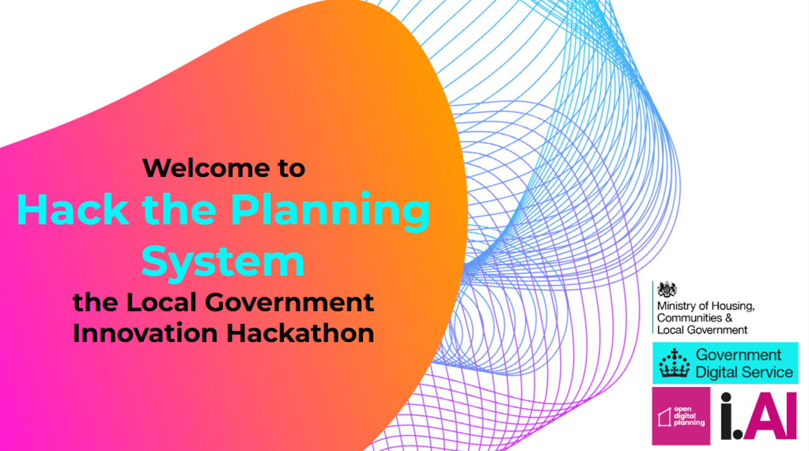

# 🏙️ Local Government Innovation Hackathon

**Dates: 📅 30 April and 1 May (two day event)**

**Location: 🏢 Nexus, University of Leeds, Discovery Wy, Woodhouse, Leeds, LS2 3AA**

**Contact:**

---

## 👋 Welcome!
Welcome to the first Local Government Innovation Hackathon. We're excited to have you join us for a 48-hour collaboration and initiative that supports a '[blueprint for modern digital government](https://www.gov.uk/government/publications/a-blueprint-for-modern-digital-government)'.

This Hackathon is being organised by [Government Digital Service](https://www.gov.uk/government/organisations/government-digital-service) (GDS) and the [Incubator for AI](https://ai.gov.uk/) (i.AI), in partnership with the [Ministry of Housing, Communities and Local Government Digital Planning programme](https://www.localdigital.gov.uk/digital-planning/) and [Open Digital Planning](https://opendigitalplanning.org/).

Planning reform is key to economic growth and digital transformation can make it happen. This is your chance to work directly with i.AI engineers, technical and planning experts to build solutions that could shape the future of public services.

This document contains everything you need to know to help you make the most of your hackathon experience. 

## 📋 Agenda

Below is the draft agenda for this two-day event. (This may be revised further)

| Time | Headline | Location |
| ----- | :---- | :---- |
| **Day 1: Foundations and Development** |  |  |
| 9:00 \- 10:00 | Registration & Welcome | Atrium |
| 10:00 \- 11:00 | Opening session, the planning system and the challenge statements | Theatre |
| 11:05 \- 11:30 | Team formation | Move to breakout space |
| 11:30 \- 11:45 | Break | Atrium |
| 11:45 \- 12:30 | Datasets, case studies, IT and tech resources  | Theatre |
| 12.30  | Hacking begins\!  |  |
| 12:30 \- 13:30 | Lunch (provided) | Atrium |
| 13:30 \- 13:45 | Mentor introductions (optional) \- introductions of who they are and how they can help | Theatre |
| 13:45 \- 17:00 | Hacking continues with access to specialist mentors | Mentor and seminar rooms |
| 17:00 \- 18:00 | Progress Check-in \- teams present progress and challenges | Seminar |
| 18:00 | Continue hacking \- venue closes at 10pm |  |
| **Day 2: Finalisation, Presentations, and Judging** |  |  |
| 8:30 \- 10:00 | Breakfast (provided) | Atrium |
| 8:30 \- 10:00 | Hacking continues |  |
| 10:00-10:20 | Morning welcome | Theatre |
| 10.20-13:00 | Final development and presentation preparation |  |
| 12:00 \- 13:00 | Lunch (provided) and opportunity to rehearse presentations | Atrium |
| 13:00 \- 15:00 | Team presentations to judges | Theatre |
| 15:00 \- 16:00 | Judging & Deliberation  | Seminar room |
| 15:00 \- 16:00 | Networking alongside the judges deliberation | Atrium |
| 16:00 \- 16:30 | Awards & Closing Ceremony | Theatre |
| 16.30 \- 17:00 | Further networking  | Atrium |

## 🎯 Challenge information

Through feedback you have shared and wider engagement with stakeholders we have identified five key challenge areas within the planning system which will form the focus of our two-day hackathon. We're seeking innovative solutions to address these complex issues.

During the hackathon, you'll work in multi-disciplinary teams focused on a specific problem statement, with facilitators, mentors and experts available to guide you through the process.  

To help us allocate you to an area that matches your interests and expertise, please [take a look at the problem statements and complete this form, by 25 April,](https://forms.office.com/e/Dr0XbtKtqm) and rank the problem statements you'd most like to work on, in order of preference.  While we'll do our best to assign you to your preferred area, please note that we also need to create balanced teams across all the challenge areas. 

Please complete the form before the event. If you haven't managed to do this in advance we will allocate you into a multi-disciplinary team. 

## 📝 Registration and teams

Please arrive between 9am and 10am on 30 April to register and to get into teams for the hackathon.

We're expecting to have 10-15 teams of between 4-6 members each. 

## 🏆 Judging criteria 

The projects developed during the hackathon will be evaluated by the judges based on:

* **Impact:** Potential to improve the planning system, effectiveness and scalability of the application   
* **Innovation:** Originality, creativity and technical viability of the solution.  
* **Presentation:** Clarity, persuasiveness, and professionalism of the presentation.

## 🧩 Logistics

Set out below is some useful logistical information. 

What to bring: 

* 💻 Please bring your own laptop and charger  
* 📏 Any stationary you'll need  
* 🍶 Water bottle (recommended) 

Food and refreshments: 

* 🥪 Lunch provided both days  
* 🍳 Breakfast on day two  
* ☕ Tea, coffee and water available throughout

Dietary requirements: If you haven't informed us of your dietary needs, please email [local-government@digital.cabinet-office.gov.uk](mailto:local-government@digital.cabinet-office.gov.uk) as soon as possible.

**Accommodation:**

🏨 Please arrange your own overnight accommodation.

**Venue accessibility and transport information:** 

Details of how to get to the venue and accessibility is available on the University of Leeds website: [https://www.accessable.co.uk/university-of-leeds/access-guides/nexus](https://gbr01.safelinks.protection.outlook.com/?url=https%3A%2F%2Fwww.accessable.co.uk%2Funiversity-of-leeds%2Faccess-guides%2Fnexus&data=05%7C02%7Cemma.crowe%40communities.gov.uk%7C56edf3e094064557b40108dd82617dd5%7Cbf3468109c7d43dea87224a2ef3995a8%7C0%7C0%7C638810077743860646%7CUnknown%7CTWFpbGZsb3d8eyJFbXB0eU1hcGkiOnRydWUsIlYiOiIwLjAuMDAwMCIsIlAiOiJXaW4zMiIsIkFOIjoiTWFpbCIsIldUIjoyfQ%3D%3D%7C0%7C%7C%7C&sdata=xqX45sqaFYIHyIgoR0cH2BFQ0TPV0WF6TZ7ULvIkXHk%3D&reserved=0). 

We have secured use of the first floor, including the Theatre, Seminar Rooms, Atrium and breakout spaces around the venue for this event.

**Communications and social media:**

Please be aware that there are local elections on 1 May. Government departments will not share social media content during the hackathon: event highlights will be embargoed and shared from Monday 5 May onwards. Participants from other public sector organisations should follow their own guidelines.

**Participation guidelines:**

🤝 We want everyone to be able to participate and thrive in the hackathon. Whether you're a seasoned professional or a first-time participant, everyone is encouraged to bring their ideas to the table and contribute to the collective success of the hackathon. Here are some guidelines to follow to ensure everyone is treated properly.

**We encourage everyone to:**

* 👂 Treat all participants with respect and kindness  
* 💬 Communicate openly and constructively  
* 🌈 Value diverse perspectives and ideas  
* 🤲 Support equal participation for all

**Please avoid:**

* ❌ Discriminatory behaviour or language  
* ⛔ Actions that prevent others from fully participating

If you have any concerns during the event please speak with the organisers immediately.

## 💻 Technical information and support

**Mentor availability and expertise:**

🧠 Planning experts and specialists from the Incubator for Artificial Intelligence (i.AI), will be available as mentors during the hackathon. More information will be provided at the event about who is available. 

## 6. ⏭️ What happens next?

**Feedback:**

📣 We welcome your feedback at the conclusion of the hackathon to help improve future events. 

**Communications about the hackathon:**

📱 We'll be sharing highlights and outcomes from the hackathon on social media from Monday 5 May \- following the local elections pre-election period.

**Future opportunities:**

🔮 Watch out for announcements about upcoming local government hackathons. 

If you opted in, when completing the skills survey for the hackathon, we'll keep you informed about future events. 

 
